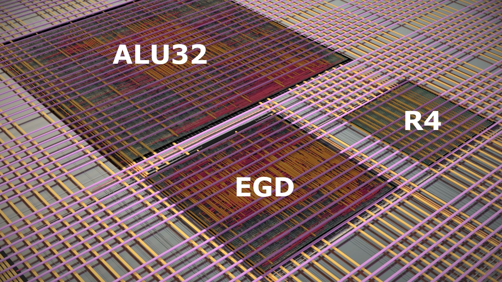

# IC1-CASS 2023 Caravel User Project

  

----

  

----

The IC1-CASS is one of the five tape-outs done in 2023 as part of the Universalization of IC Design from CASS [(UNIC-CASS)](https://ieee-cas.org/universalization-ic-design-cass-unic-cass) Program.
The IC1 only includes digital blocks. The Design Teams who were part of it are:

| Design Teams |
| ------------- |
| 🇲🇾: [EGD](https://repositories.efabless.com/raven_crown/UNIC-CASS_precheck_egd_top) |
| 🇲🇾: [R4 Butterfly](https://github.com/LyeGuanYan/Radix4_butterfly) |
| 🇧🇷: [ALU32B](https://github.com/BigNixon/caravel_uniccass_example)  |

Top-level by Rodrigo N. Wuerdig

----

Refer to [README](docs/source/index.rst#section-quickstart) for a quickstart of how to use caravel_user_project

Refer to [README](docs/source/index.rst) for this sample project documentation. 
